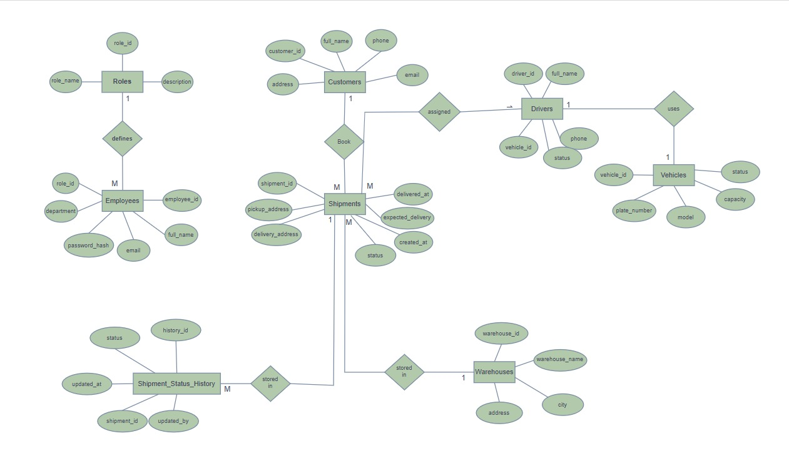

# 🚆 Swiftrail Logistics - Secure Shipment Management Assistant (MCP Server)

## 📌 Project Overview & Problem Statement
**Swiftrail Logistics** is a nationwide freight and shipping enterprise. Operations staff needed an AI assistant to look up shipment statuses, query warehouse logs, and process shipment cancellations. 

**The Risk:** Giving an LLM direct SQL or shell access to production database tables creates severe vulnerabilities—such as arbitrary data modification, invalid state transitions, or unverified cancellations.

**The Solution:** An **MCP (Model Context Protocol) Server** sits in front of the SQLite database. The model interacts purely through structured, defensive business logic tools, preventing raw SQL execution while implementing strict human-in-the-loop approvals for sensitive actions.

---

## 🗄️ Database Architecture & ERD
The system uses a relational database tracking `Roles`, `Employees`, `Customers`, `Warehouses`, `Vehicles`, `Drivers`, `Shipments`, and `Shipment_Status_History`.



---

## 🛠️ MCP Protocol Concerns Breakdown

| Protocol Concern | Implementation in Swiftrail MCP | File Location |
| :--- | :--- | :--- |
| **1. Capability Negotiation** | Handshake verifies client supports Elicitation & Resources during connection initialization. | `agent/agent.py` |
| **2. Dynamic Notifications** | Tools list dynamically updates based on employee authorization level via `tools/list_changed`. | `mcp_server/server.py` |
| **3. Elicitation (Human-in-Loop)** | Cancelling a shipment (`user_confirmed=False`) pauses execution mid-call to request explicit supervisor confirmation. | `mcp_server/tools.py` |
| **4. MCP Resources** | Exposes static read-only Swiftrail Refund & Cancellation Policy document (`resource://swiftrail/refund_policy`). | `mcp_server/resources.py` |
| **5. Prompts Templates** | Provides parameterized prompt template for drafting delayed train apologies (`draft_delay_apology`). | `mcp_server/prompts.py` |
| **6. Transport Migration** | Developed initially over `stdio` for local testing, then transitioned to `Streamable HTTP (SSE)`. | `mcp_server/server.py` |
| **7. Progress Tracking** | Long-running warehouse audit report streams real-time progress updates back to the client. | `mcp_server/tools.py` |
| **8. Defensive Tool Design** | Input validation using Pydantic schemas (`additionalProperties: False`) and SQL injection-proof parameterized queries. | `mcp_server/schemas.py` |

---

## ⚖️ Tool Security Classification (Comparison Note)

* **Read-Only Tools:** `get_shipment_details` — Safe to execute automatically without state modification.
* **Write Tools:** `change_shipment_status` — Modifies database state; requires strict validation and logging into `Shipment_Status_History`.
* **High-Risk Write Tools:** `change_shipment_status(status="Cancelled")` — Requires mid-call Human Elicitation (`user_confirmed=True`).

---

## 🚀 How to Run the Project

1. **Initialize Database:**
   ```bash
   python build_db.py
